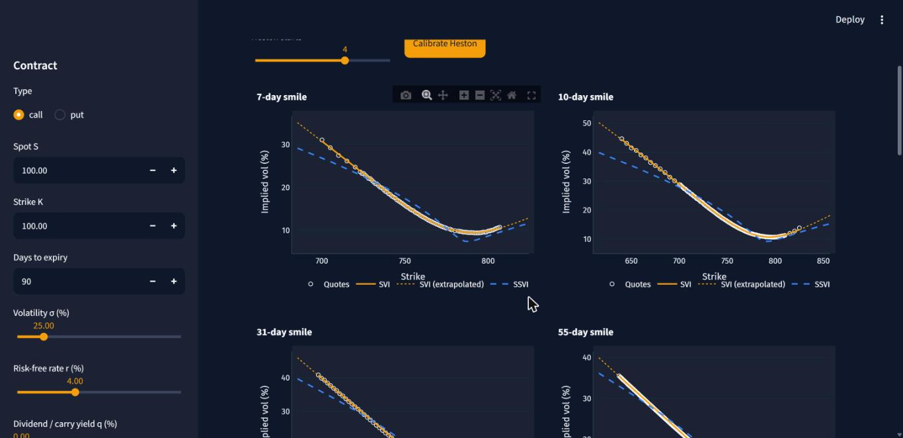

# BS+ — Black-Scholes and beyond

A compact, tested option-pricing library in Python (NumPy + SciPy) with an interactive
Streamlit dashboard. It starts from Black-Scholes, fixes what a plain implementation gets
wrong or leaves out, and is validated on a **real SPY option chain**.



## What is in the box

| Area | Module | Highlights |
|---|---|---|
| Closed-form pricing | [`black_scholes`](api/black_scholes.md) | Generalized BSM (dividend yield, Black-76, Garman-Kohlhagen), 8 analytic Greeks, cash dividends |
| Implied volatility | [`implied_vol`](api/implied_vol.md) | Bracketed Newton/bisection that converges for every arbitrage-free price |
| Early exercise | [`american`](api/american.md) | Leisen-Reimer and CRR trees, cash dividends, tree Greeks, American implied vol |
| Exotics | [`barrier`](api/barrier.md) | All 8 single-barrier types with rebates; Brownian-bridge Monte Carlo |
| Stochastic vol | [`heston`](api/heston.md) | Little-trap characteristic function, fast quadrature, MC, multi-start calibration |
| Smiles | [`svi`](api/svi.md) | SVI fits with butterfly and calendar arbitrage checks |
| Surfaces | [`surface`](api/surface.md) | Arbitrage-free SSVI, Dupire local vol, local-vol Monte Carlo |
| Market data | [`market`](api/market.md) | Chain cleaning, parity-implied forwards, de-Americanization |
| Simulation | [`monte_carlo`](api/monte_carlo.md) | Antithetic + control variates, arithmetic Asian options |

## Install

```bash
pip install "bsplus[data]"          # library + market-data helpers
pip install "bsplus[app]"           # ... plus the Streamlit dashboard
```

or from source:

```bash
git clone https://github.com/Samarty-1/black-scholes-plus.git
cd black-scholes-plus
pip install -e ".[dev]"
pytest
```

## Thirty-second tour

```python
import bsplus as bs

bs.price(42, 40, 0.5, 0.10, 0.20, "call")                         # 4.7594 (Hull)
bs.implied_vol(4.7594, 42, 40, 0.5, 0.10, "call")                  # ~0.20
bs.american_price(100, 110, 1.0, 0.08, 0.2, "put").early_exercise_premium
bs.barrier_price(100, 90, 95, 0.5, 0.08, 0.25, "call", "down-and-out", q=0.04, rebate=3)  # 9.0246
```

Continue with [Getting started](guide/getting-started.md), or jump to the
[SPY study](spy-study.md) to see the models on real quotes.

!!! note
    This is an educational and research tool. It is not trading advice.
