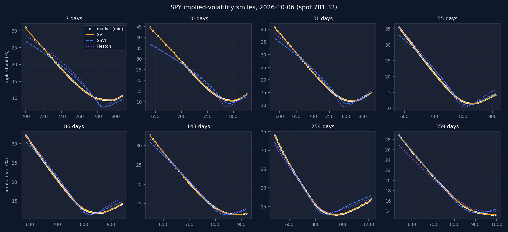
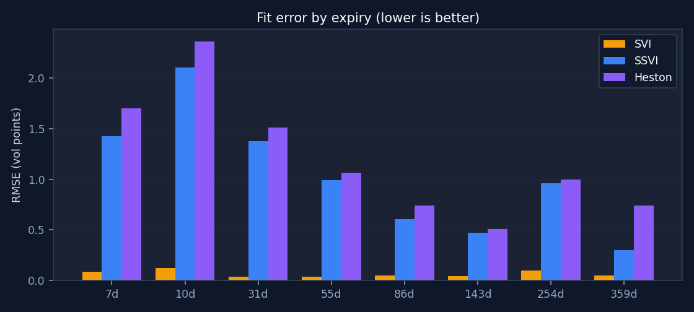

# SPY volatility-surface study (2026-10-06)

*Generated by `examples/spy_surface_study.py` from the bundled snapshot
`data/spy_chain_2026-10-06.csv` (Yahoo Finance via yfinance). Spot 781.33, rate
4.035% (13-week T-bill, `^IRX`). Re-run the script to reproduce every number.*

## Data

2,586 raw quotes over 8 expiries (7-359 days);
2,246 after removing no-bid, crossed, >35%-wide and zero-open-interest quotes; 1,241
out-of-the-money quotes in the final surface. Building it took 26 s, almost all of
it de-Americanization.

SPY options are **American** and SPY pays dividends. Two consequences found while
building this study:

1. **Put-call-parity regression fails.** Regressing `C - P` on strike to get the discount
   factor gave `D > 1` (a negative rate, -2% to -49%) on every expiry, because the
   early-exercise premium of in-the-money puts grows with strike. The library now
   refuses that regression for such chains and takes `D` from the T-bill rate instead.
2. **De-Americanizing matters for long expiries.** Each quote's vol is solved on the
   American (Leisen-Reimer) tree and the forward is re-estimated from European-equivalent
   prices. Compared with treating the quotes as European:

| days | forward shift % | median IV change (vol pts) | max |IV change| (vol pts) |
|---|---|---|---|
| 7 | -0.006 | -0.017 | 0.048 |
| 10 | 0.001 | -0.000 | 0.006 |
| 31 | 0.022 | -0.006 | 0.098 |
| 55 | 0.052 | 0.024 | 0.170 |
| 86 | 0.063 | -0.007 | 0.183 |
| 143 | 0.158 | -0.079 | 0.371 |
| 254 | 0.353 | -0.147 | 0.626 |
| 359 | 0.288 | -0.257 | 1.215 |

Under a month the difference is negligible; at one year it is up to
1.2 vol points - larger than the SVI fit error itself.

## Fits

| Model | What it is | Overall RMSE (vol pts) | Static-arbitrage free |
|---|---|---|---|
| SVI | 5 parameters per expiry, fitted independently | 0.067 | not guaranteed: 0 of 8 slices fail the butterfly check; 1 of 7 adjacent pairs cross (calendar arbitrage) on a wide k grid |
| SSVI | 1 ATM variance per expiry + 3 global parameters | 1.102 | **yes, by construction** |
| Heston | 5-parameter stochastic-vol model (dynamics, not just a fit) | 1.335 | yes (it is a model) |

| days | quotes | ATM IV % | SVI | SVI arb-free | SSVI | Heston |
|---|---|---|---|---|---|---|
| 7 | 87 | 9.806 | 0.086 | yes | 1.426 | 1.702 |
| 10 | 126 | 11.340 | 0.123 | yes | 2.104 | 2.363 |
| 31 | 139 | 12.803 | 0.037 | yes | 1.379 | 1.514 |
| 55 | 252 | 12.916 | 0.040 | yes | 0.994 | 1.064 |
| 86 | 279 | 13.481 | 0.050 | yes | 0.604 | 0.744 |
| 143 | 140 | 14.236 | 0.043 | yes | 0.472 | 0.508 |
| 254 | 129 | 15.278 | 0.098 | yes | 0.962 | 0.998 |
| 359 | 89 | 15.892 | 0.050 | yes | 0.302 | 0.743 |

**SSVI**: rho = -0.486, eta = 1.346, gamma = 0.500, so
eta(1+|rho|) = 2.000. Both no-arbitrage bounds (gamma <= 0.5,
eta(1+|rho|) <= 2) are essentially *active*: the data wants more short-dated curvature
than the sufficient conditions allow. That is the price of the guarantee.

**Heston** (8-start calibration, 41 s): v0 = 0.0089, kappa = 12.55,
theta = 0.0397, xi = 3.00, rho = -0.581; Feller condition
violated. Short-pass RMSE from each start (vol pts):
1.34, 1.34, 1.34, 1.34, 1.34, 1.34, 1.34, 1.34.

## Reading the results

* **SVI fits best** because it has the most freedom - 5 parameters for every expiry.
  On this (de-Americanized) data 0 slice(s) fail the butterfly check. Slices
  never cross inside the quoted strikes,
  but in the extrapolated wings 1 adjacent pair(s) cross - worst
  31d/55d on 9% of the
  grid - which is calendar arbitrage. Fine for interpolating quotes; unsafe to
  extrapolate or to feed into local vol, because nothing ties the slices together.
  (On this snapshot, before de-Americanization the 359-day slice also failed the butterfly
  check: that "arbitrage" was the early-exercise premium, not the market.)
* **SSVI** gives up fit (mostly at the shortest expiries, where the skew is steepest) for
  a surface that is guaranteed arbitrage-free and smooth in maturity - the input a
  local-volatility model needs.
* **Heston** fits worst at short maturities. It is a diffusion, so the smile it can
  generate over a few days is limited; a parameter at its bound (xi = 3.00, kappa = 12.6) is the usual symptom. This is a known limitation of the
  model (jumps or rough volatility are the usual fixes), not a calibration bug:
  8 of 8 starting points reach the same optimum.

*Snapshot quotes are delayed and mid-prices are used; this is a methods demonstration,
not trading advice.*
